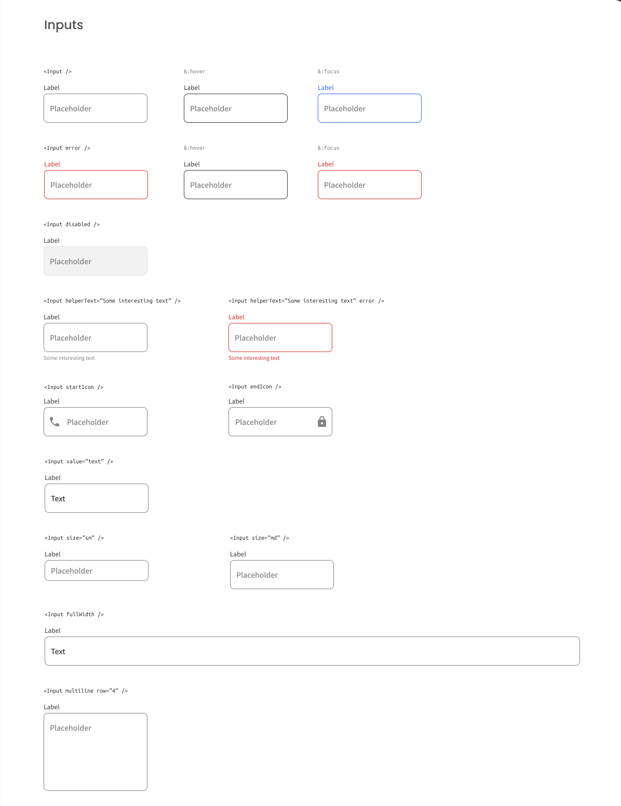

# Input Component

## Challenge: Create a reusable input with all the states in the design and a page displaying all the states.

Use Front-end libraries like React. Don’t look at the existing solution. Fulfill user stories below:

-   User story: I can see error state
-   User story: I can choose to disable input
-   User story: I can choose to have helper text
-   User story: I can choose to have an icon on the left or right (Use Google Icon and at least 5 variants)
-   User story: I can have different input sizes
-   User story: I can have different colors
-   User story: I can choose to have input take the width of the parent
-   User story: I can have multiline input like a textarea
-   User story: When I hover or focus, I can see visual indicators
-   User story: I can still access all input attributes
-   User story (optional): Show input in a similar way like the design. Otherwise, showing the input in multiple states is enough
    Icon: https://google.github.io/material-design-icons/

[Check the design here.](https://www.figma.com/file/slzHnI05qpbBeC33ZMZGa5)

As long as you fulfill all the user stories, you can give your personal touches by adding transition, using your own images, changing colors, or even creating your own layout,...

Once you completed, submit your solutions by providing URLs for both GitHub repository and live app on Netlify and explain briefly what you have done.

Once you're done, send me the link of your repository on Slack.

Good luck!
